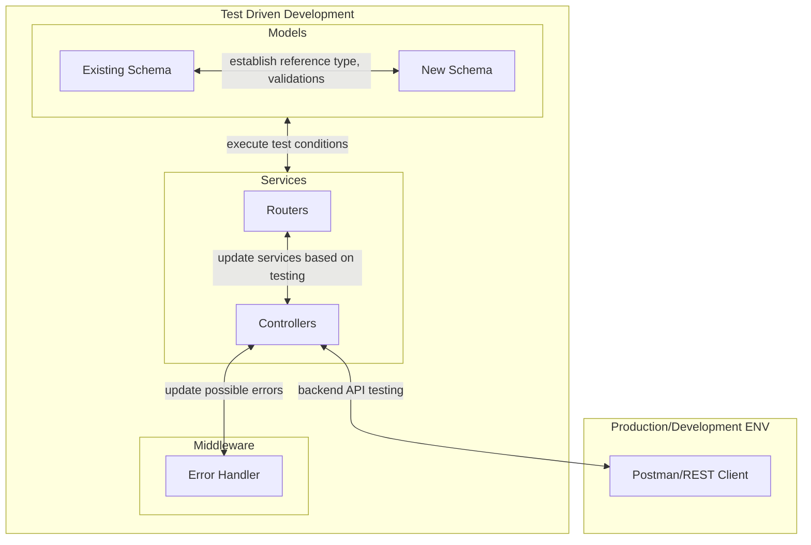

# Part 4

<hr>

# 1 - Backend Testing fundamentals
- **Context** : Backend-testing using `node:test`, `node:assert` and `supertest`.
- **Reason** : Completely new topic and zero-experience from previous projects
- **SOLUTION** : 
    - After every topic in each section of Part 4, practice tests for 'Notes App' in a different context. For example on the current project in Part 4 exercises, 'Blogs App'
    - Seek coding assistance from GitHub CoPilot
    - Read through example tests from documentations

<br>
<hr>

# 2 - HTTP status codes
- **Context** : HTTP Methods use similar status codes
- **Reason** : 
    | HTTP Method	| Response Status Codes |
    | ----- | ------ |
    | GET	| 200, 304, 400, 404, 500 |
    | POST |	200, 201, 400, 403, 404, 500 |
    | PUT	 |200, 204, 400, 404, 409, 500 |
    | PATCH |	200, 204, 400, 404, 409, 500 |
    | DELETE |	200, 202, 204, 400, 404, 500 |
    | | |

- Common status codes happen because HTTP method can have multiple response status codes because the outcome of a request can vary based on different factors.

    - `200 OK`: The request has succeeded.
    - `400 Bad Request`: The server could not understand the request due to invalid syntax.
    - `404 Not Found`: The server could not find the requested resource.
    - `500 Internal Server Error`: The server encountered an unexpected condition which prevented it from fulfilling the request.


<br>
<hr>

# 3 - Data re-initialization in test DB using `beforeEach` 
- **Context** : 
    - For Testing purposes, Test-database needs to be re-initialized before each test for executing assertions successfully. 
    - However, due to differences in the order of execution of the `Promise` the data can be initialized in different ways.
- **Reason** : Depends on the sequence preferences, if any, of execution of `Promise`s
- **SOLUTION** :
1. Using `for` loop for control over execution order of `Promise` 
    ```javascript
        beforeEach(async() => {
            // executed in no specific order
            for(let blog of helper.initialBlogs){
                let blogObject = new Blog(blog)
                await blogObject.save()
            }
        })

        // tests to verify HTTP methods 
        ...
    ```
2. using `Promise.all` method to allow the completion of every `Promise` in the registered order
    ```javascript
        beforeEach(async() => {
                // executed in specific order promises registred
                await Promise.all(helper.initialBlogs.map(async (blog) => {
                    let blogObject = new Blog(blog)
                    blogObject.save()
                }))
            })

            // tests to verify HTTP methods 
            ...
    ```
3. most ideal method, using `mongoose` built-in methods for `insert` and `delete` 
    ```javascript
            beforeEach(async() => {
                await Blog.deleteMany({})
                await Blog.insertMany(helper.initialBlogs)
                })

                // tests to verify HTTP methods 
                ...
    ```

<br>
<hr>

# 4 - Password Hashing fundamentals
- **Context** : Hashing passwords (manually) using external libraries
- **Reason** : Obviously, user data such as passwords must be encrypted, hence an enhanced level of encryption ensures user security
- **SOLUTION** : In the current context ([FullStackOpen-core-part4](https://github.com/prak112/FullStackOpen-core-part4.git)), for user administration in saving blog posts, we are using [`bcrypt`](https://github.com/kelektiv/node.bcrypt.js/#nodebcryptjs) to ensure password hashing through *[Salt Rounds](https://github.com/kelektiv/node.bcrypt.js/#a-note-on-rounds)*, as simplified below.
    - *Purpose* : Salt rounds are used to 'thwart brute force attacks' by making the hashing process slower.
    - *How It Works* : 
        - Number of salt rounds is the exponent in the calculation of how many times the hashing algorithm is executed. 
        - More rounds = more hashing iterations, 
        - Brute force attacks slowed down and more secure.
    - *Example* : If you choose 10 salt rounds, the algorithm will run 2^10 (or 1024) times.
    - *Balance between Security and Performance* : 
        - Higher salt rounds increase security but also make the hashing process take longer.
        - The cost of increasing rounds on 2 GHz core :
        ```css    
            rounds=8 : ~40 hashes/sec
            rounds=9 : ~20 hashes/sec
            rounds=10: ~10 hashes/sec
            rounds=11: ~5  hashes/sec
            rounds=12: 2-3 hashes/sec
            rounds=13: ~1 sec/hash
            rounds=14: ~1.5 sec/hash
            rounds=15: ~3 sec/hash
            rounds=25: ~1 hour/hash
            rounds=31: 2-3 days/hash
        ```

<br>
<hr>

# 5 - Process Flow between Backend-Database to Implement new Feature 
- **Context** : 
    - In MERN, if every new concept is implemented from the granular level, unlike Django, the sequence of operations to know are essential. 
    - In current context, we use `MongoDB-mongoose` for establishing backend-database communications
    - If a new table/`collection` is introduced to implement a new feature, such as user administration, then the sequence of actions for an efficient process flow are as follows:



<br>
<hr>

# 6 - Generating JSON Web Token
- **Context** : What is included in 'process.env.SECRET'?
- **Reason** : For user authentication, a `jsonwebtoken` (`JWT`) must be generated
- **SOLUTION** :    
    - Any string, preferably auto-generated as a cryptic string
    - Using `node` built-in library for auto-generating a cryptic string as follows:
    ```javascript
        const crypto = require('crypto')
        crypto.randomBytes(32).toString('hex')  // SECRET
    ```
    - *NEVER* save it in the source code. Generate in the terminal. Save it in `.env` 

<br>
<hr>

# 7 - Authorization Header and Authentication Scheme fundamentals
- **Context** : How to retrieve the 'Authentication Header' value for implementing tests with backend API using Postman/REST Client ?
- **Reason** : To authenticate the user when a `POST` request is generated
- **SOLUTION** :
    - `HTTP request` has [`Authorization` headers](https://developer.mozilla.org/en-US/docs/Web/HTTP/Headers/Authorization) in the format - `<auth-schemes> <auth-parameters>`
    - There are multiple `<auth-schemes>` ([Authentication Schemes](https://developer.mozilla.org/en-US/docs/Web/HTTP/Authentication#authentication_schemes)) available in a `HTTP request` `Authorization` header.
    - Most common ones are - `Basic`, `Bearer`, `Digest`
    
    |Feature        | `Basic`           | `Bearer`*            | `Digest`          |
    |---------------| ----------------- | -------------------- | ----------------- |
    | **SECURITY**  | Credentials sent as `base64` encoded (plain text)| Credentials tokenized on server-side and stored on client side. Can be set to expire. | Password saved on server as plain-text/reversibly-encrypted format for verification with hashed-version. | 
    | **USAGE**  | Simple, credentials sent with each request | Simple & safe, token sent with each request | Complex due to hashing process | 
    | **STATE**  | *Stateful*, since credentials required for each request | *Stateless*, request contains credentials-encrypted token to authenticate user for each request | *Stateful*, random new hashed value different for each request | 
    | **API Suitability**  | Only simple authentication, Not suitable for modern APIs | Suitable, specifically for APIs with `JWT`s and Single Sign-On (SSO) | Not Suitable, due to server-side storage | 
    ||||| 
    
    - Based on our project (Reading list - Blogs App), the `Bearer <auth-scheme>` would be suitable for our User Authentication considering its beginner-friendly secure state of tokenizing user access.

<br>
<hr>

# 8 - User Authentication alternatives
- Are there other means to make 'Token-based authentication' more secure without placing an expiry time on the token ?

- How to implement 'cookies' instead of 'server-side session' (*It is also quite usual that instead of using Authorization-header, cookies are used as the mechanism for transferring the token between the client and the server.*)

<br>
<hr>

# 9 - Authentication process - Node.js VS Django
- How different and manual is the user authentication in comparison to Django ? Does Django do a 'server-side session' ?


# 10 - Test execution process flow
- What is considered in the test's process flow ?

- What is considered NOT to be in the test's process flow ?

# 11 - Test setup for user authentication
- **Context**: Unauthorized access error (401) even after setting up `beforeEach` with user registration, login and token extraction
- **Reason**: Simple. `beforeEach` syntax does NOT take 'text description'!
- **Solution**:
    - *BEFORE*
        ```javascript
            ...
            beforeEach('Administer user access', async() => {
                ...
            })
        ```
    - *AFTER*
        ```javascript
            ...
            beforeEach(async() => {
                ...
            })
        ```